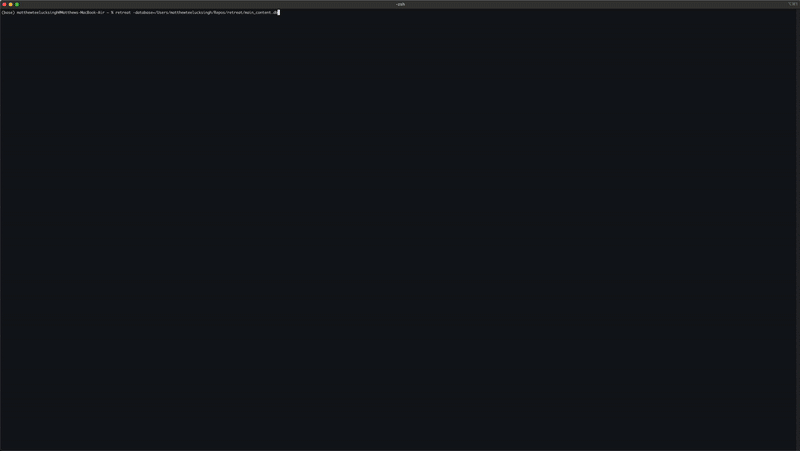
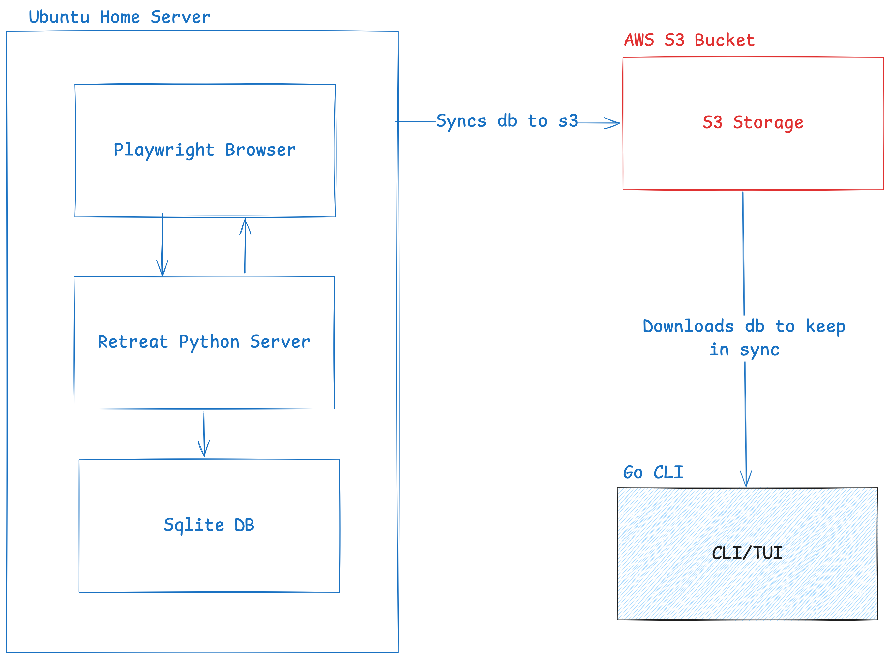
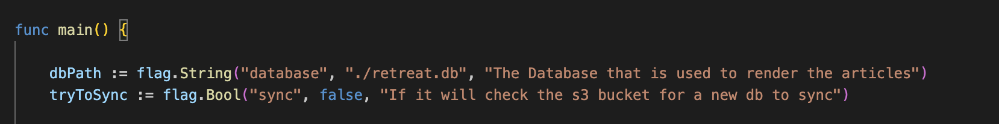

# Retreat
A basic command line TUI that loads RSS feeds and articles in the terminal. Allowing you to read your morning news letters from the terminal. 



Project is written mainly for my very specific use case (so some strange features will probably end up being added as I think of ideas to optimize my morning workflow) but providing the source incase someone else wants to use it. 

## Design
Currently the application is built around 2 core components: The Retreat Server and the Retreate CLI/TUI


It was designed with simplicity and low cost in mind. My current deployment environment revolves around my homeserver where the Retreat Server is running as a cron job. Every run it checks all of my RSS feeds for changes and then uses a headed playwright browser and firefox's [reader mode](https://support.mozilla.org/en-US/kb/firefox-reader-view-clutter-free-web-pages) to extract the core content of the new articles. After it builds a full sqlite db of all the content it uploads this db to some remote S3 storage. 

On the client machine I can then use the TUI/CLI to browse these articles. The TUI downloads the sqlite database from s3 locally and then checks if a newer version has been uploaded to blob. If it has it re-downloads the db. 

This is by no means a perfect design but I really wanted a simple way to read my morning news through the terminal at work that I could write myself over a weekend and that would be basically free - so this is what I came up with! By leveraging my existing homelab server and relying on a basic S3 bucket as my only external service its dirt cheap to operate and very simple to manage. Part of my cringes everytime I see a db getting redownloaded from blob - it just feels wrong so I may implement a webserver that renders the content via a REST API at some point but right now its good enough!

## CLI
The CLI is a super basic Go BubbleTea application that uses stock Bubble components to render the feeds/articles and the markdown content. The CLI surface area is very small: 

And I want to try to keep it as small as possible (ideally I would never add additonal args). If there is some future functionality that I want to add that requires additional config I will prioritize using the db over adding additional args.

## Python Server
Currently by far the most complicated part of the project. At a high level its core functionality is as follows:
- Launches a playwright headed browser page for each article in an rss feed.
- Simplifies the article's HTML content via firefoxe's built in reader mode to make it more readable (See the javascript implementation of their readabiliy algorithm [here](https://github.com/mozilla/readability)).
- Converts article html into markdown via the `markdownify` [python package](https://pypi.org/project markdownify/).
- Stores new article content in the sqlite db and syncs the db to S3.

I tried to keep the API surface pretty lean so the server expects a list of rss feeds that are accessable via url for python to extract articles from. You can find my list of rss feeds that I'm currently using the tool with [here](./docs/rss_feeds.txt). 

### Example shell command:
This is how I would run the python server to ingest all of my feeds and articles end-to-end:
```
/home/matthew/Repos/retreat/retreat_server/.venv/bin/python /home/matthew/Repos/retreat/retreat_server/cli.py --database=/home/matthew/Repos/retreat/main_content.db -f $(cat /home/matthew/Repos/retreat/docs/rss_feeds.txt) -l -p &> /home/matthew/Repos/retreat/outputs.log
```
The server does maintian a copy of the sqlite databasde that it uploads to blob - in this case `main_content.db`. 

It is worth noting that the server requires playwright to be able to run in headded mode to avoid unexpected behaviour. This means that if you are running it via SSH or on a remote server you'll need a way of running the program with a display server - the easiest way is to use `Xvfb`:
```
xvfb-run /home/matthew/Repos/retreat/retreat_server/.venv/bin/python /home/matthew/Repos/retreat/retreat_server/cli.py --database=/home/matthew/Repos/retreat/main_content.db -f $(cat /home/matthew/Repos/retreat/docs/rss_feeds.txt) -l -p &> /home/matthew/Repos/retreat/outputs.log
```

## Setup
Asside from setting up the python envs with the `requirements.txt` and the go cli via `go install` the only external config you'll need is your AWS (or S3 compatable service like minio) credentials pointing to your bucket in the `~/.aws/credentials` file. 

Currently the bucket name is hard coded to `retreat-articles` and the name of the database in that bucket is hardcoded to `feed_db.sqlite` but you should be able to replace all references in the s3 api in python and the database package in go if you wanted to implement your own storage system (If I keep adding features I'll probably make this dynamic at some point).

I mostly wrote out this README for my benefit so that I remember how to set up the app if I forget about it and need to come back after 6 months but if someone else finds this useful then feel free to take the code and do something with it - hopefully it helps

## License
Copyright (c) matthewteelucksingh <teelucksingh.matthew1@gmail.com>

This project is licensed under the MIT license ([LICENSE] or <http://opensource.org/licenses/MIT>)

[LICENSE]: ./LICENSE
